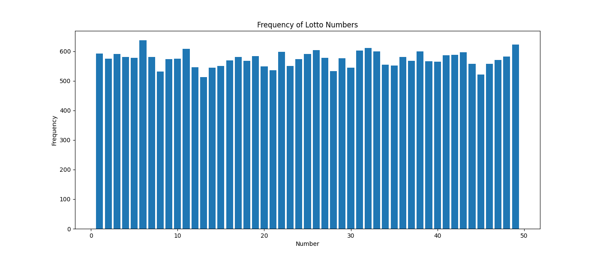
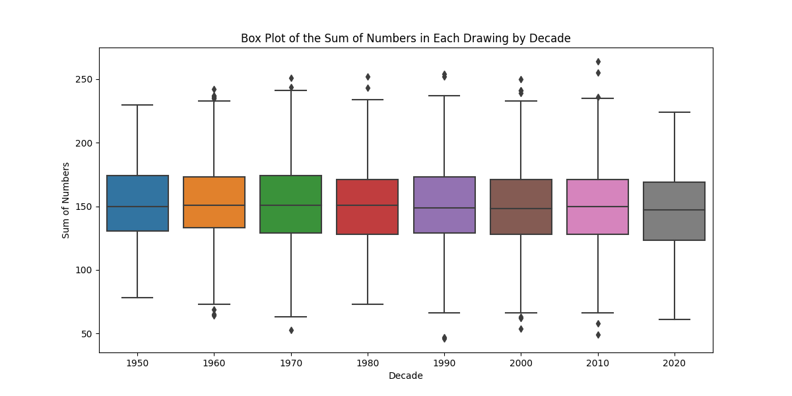
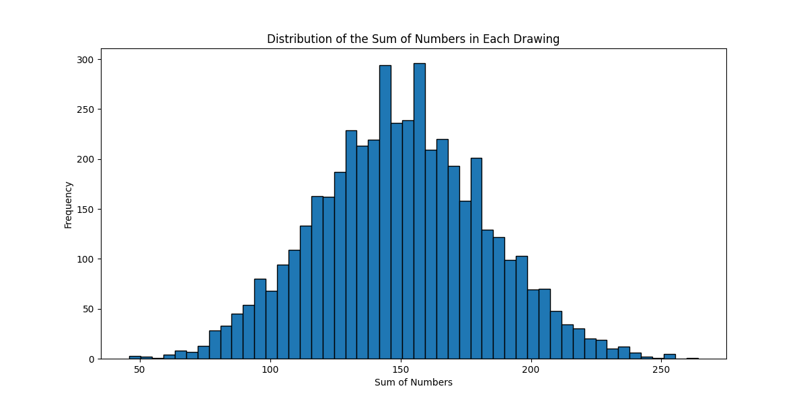
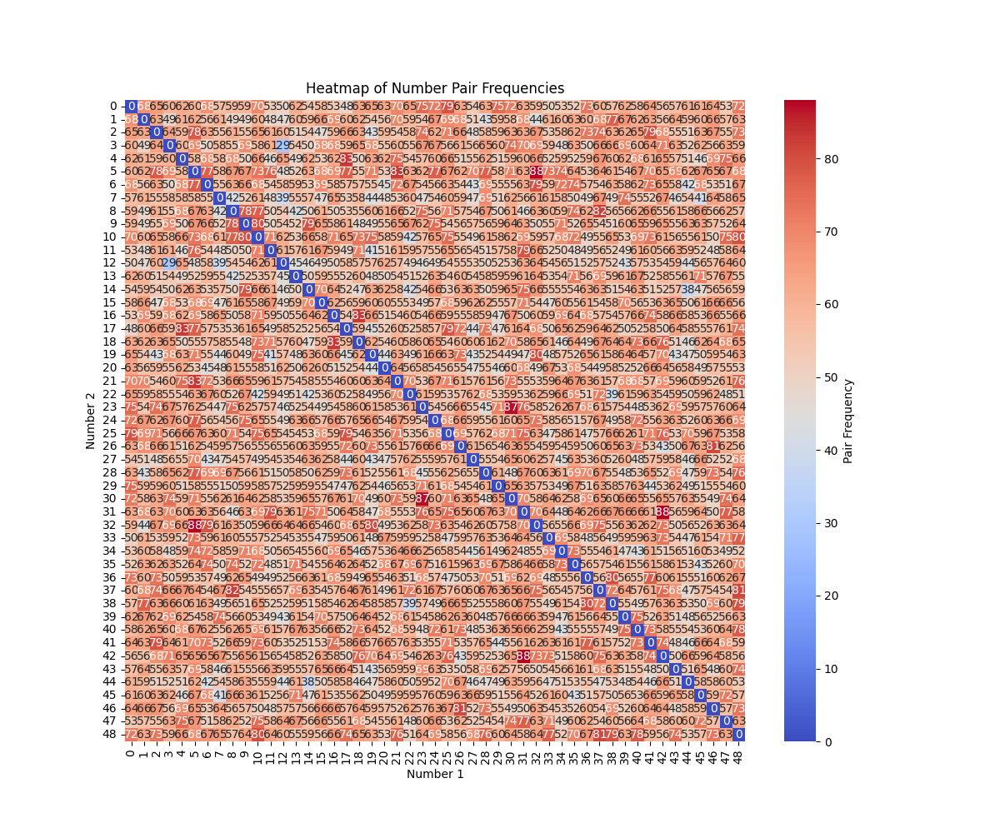

# AI lotto number Prediction
  
## Description
This is a just-for-fun project to experiment with various machine learning models for predicting German Lotto numbers. The main purpose of this project is educational, and it should not be used to make decisions related to lottery participation. The lottery is a random process, and no machine learning model can genuinely predict future lottery numbers with a meaningful degree of accuracy.

## Dataset
The dataset contains 6,000 rows of historical German Lotto drawings, including the date, six main numbers, and the super_number. The CSV file with the data is named "lotto_numbers.csv" and has the following structure:
````csv
date,number_1,number_2,number_3,number_4,number_5,number_6,super_number
1955-10-09,3,12,13,16,23,41,-1
1955-10-16,3,12,18,30,32,49,5
````
The last position is -1 if the super_number was missing.


## Models and Techniques
The project includes various models and techniques to explore the dataset and experiment with predicting lottery numbers. These include:

* Descriptive statistics and visualizations to understand the dataset.
* Time series analysis to find patterns in the occurrence of numbers over time.
* Clustering using K-means to group similar lottery number combinations.
* An ensemble stacking model with XGBoost, KerasRegressor (neural network), and RandomForestRegressor as base models and a linear regression model as the metamodel.

## Setup
1. ```bash
    pip install pandas numpy matplotlib seaborn xgboost keras tensorflow scikit-learn requests
    ```
2. Make sure you have the "lotto.csv" file in your project directory.

## Usage
1. Install the requirements
2. Runs the web scraper with `python3 web_scraper.py`
3. Load the dataset and preprocess the data.
4. Perform exploratory data analysis, visualizations, and time series analysis to understand the dataset.
5. Apply the feature engineering techniques to create new features.
5. Apply the K-means clustering algorithm to group similar lottery number combinations. 
6. Train and evaluate the ensemble stacking model using XGBoost, KerasRegressor, and RandomForestRegressor as base models and a linear regression model as the meta-model.

## Disclaimer
This project is intended for educational purposes only. Predicting lottery numbers is not a typical use case for machine learning algorithms, and the models included in this project are unlikely to provide accurate predictions. The project should not be used to make decisions related to lottery participation.

## Visualizations



